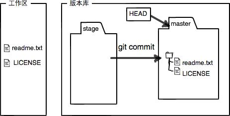

# Git学习
---
## 前言
大家都知道Linux是Linus创建的，但Linux的壮大却应该归功于全球为完善Linux而贡献代码的coder，但这么多人如何协同开发呢？因为CVS、SVN这类集中式的版本控制系统有速度慢、必须联网的缺点，Linus并未使用它们。最开始大家都把为Linux写的代码发给Linux，由他来整理，但是这个工作随着Linux的渐渐庞大而变的越来越困难。2002年的时候，Linus选择了一家商业公司的版本管理系统来管理代码，但在2005年因为一些原因闹掰，于是Linus花了2周时间用C写了一个分布式的版本管理系统，这就是Git，最先进的分布式版本控制系统。08年GitHub上线。  
分布式版本控制系统，每个人的电脑上都是一个完整的版本库。如果两个人都修改了同一个文件，就把修改的地方互相推送给对方好了。但是事实上，分布式系统也常常有一台充当服务器的机器（如GitHub），注意这个机器只是为了方便大家“交换”修改，没有它大家也能照常干活，只是“交换”不方便了而已。  
Git的优点不止不联网这些，还有强大的分支管理。
## Git Start
安装好Git，配置自己的全局信息，和别人连接的时候自报家门：

	$ git config --global user.name "Your Name"
	$ git config --global user.email "email@example.com"
之后默认机器上所有的Git仓库都是这一个配置，当然也可以对不同的仓库配置不同的用户名和email地址。
### 创建版本库
我的理解是每个项目是一个版本库。  
找一个空目录，然后初始化一个空的版本库：

	$ git init
	Initialized empty Git repository in /Users/lz/programs/gittest/.git/
### 添加和提交文件
这时候我们就能往仓库里添加东西了。内容当然必须放到创建版本库的目录里。我们在目录里新建一个README.md文件，然后执行添加命令：

	git add README.md
OK，添加完毕，然后提交到本地仓库：

	git commit -m "first readme file"
	[master 3e7c925] first readme file
	 1 file changed, 1 insertion(+)
	 create mode 100644 README.md
说明提交完毕。当然我们可以提交多次修改之后，然后commit。
### 查询状态
修改文件后，我们用`git status`可以随时查询git仓库的状态。

```
lzm:gittest lz$ git status
On branch master
Changes not staged for commit:
  (use "git add <file>..." to update what will be committed)
  (use "git checkout -- <file>..." to discard changes in working directory)

	modified:   start.md

no changes added to commit (use "git add" and/or "git commit -a")
lzm:gittest lz$ 
```
用`git diff start.md`来查看start.md的修改内容，显示的格式是Unix通用的diff格式。

```
lzm:gittest lz$ git diff start.md 
diff --git a/start.md b/start.md
index 24284b1..f6b88bb 100644
--- a/start.md
+++ b/start.md
@@ -1 +1,3 @@
-## I'm a new start!
+## I'm a nw start!
+---
+Only because saw U.
```
修改了文件后，依然要执行 `git add`和`git commit`命令才算提交完毕。

### 版本回退
每一个 `git commit`都是一个“快照”，可以恢复到某个commit之后。  
使用`git log`来查看版本变更信息。看到的一大串SHA串是版本号。可以加`--pretty=oneline`参数来让一个commit显示到一行上。  
Git的当前版本用`HEAD`表示，上一个版本是`HEAD^`，再上个是`HEAD^^`。。。往上100个版本是`HEAD~100`。现在我们回退到上个版本：

	lzm:gittest lz$ git reset --hard head^
	HEAD is now at 0333e99 modify
这时候用`git log`查看发现最新的版本已经不在了。如果想回到最新的版本肿么办？如果你还记得最新版本的“commit id”的话，可以用下面的方法过去：

	$ git reset --hard 3628164
	HEAD is now at 3628164 xxx
id不用写全，前几位就可以了。Git内部有个head指针，当你回退时，只是把head指针指向需要回退的版本，然后更新工作区的文件。  
记不住“commit id”怎么办？Git提供了一个命令`git reflog`，可以__查看历史操作记录__:

```
lzm:gittest lz$ git reflog
0333e99 HEAD@{0}: reset: moving to head^
8485f3a HEAD@{1}: commit: nothing
0333e99 HEAD@{2}: commit: modify
3e7c925 HEAD@{3}: commit: first readme file
3871b6f HEAD@{4}: commit (amend): Initial comment
832ff62 HEAD@{5}: commit (initial): Initial comment
```
### Git暂存区工作区版本库
Git有一个**“暂存区”**的概念。先来看几个概念：  
工作区（Working Directory）：你执行git命令的那个地方，不用多解释。
版本库（Repository）：工作区文件夹里的隐藏目录`.git`，这个不算工作区，而是版本库。里面存了很多东西，包括叫做“Stage”或者“Index”的暂存区。还有Git为我们自动创建的第一个分支`master`，以及指向`master`的一个指针`HEAD`。  

`git add`把修改内容提交到暂存区，然后`git commit`把修改提交到当前分支。我们在创建版本库时Git为我们创建了一个`master`分支，所以我们commit其实是往`master`分支上提交更改。commit之后暂存区就空了，见下图（图片来自廖雪峰blog）：  

### 撤销修改
当修改了一个修改又突然不想修改时，可以：

	use "git checkout -- <file>..." to discard changes in working directory
如果暂存区有东西，则恢复到暂存区的状态，如果没有，则恢复到上一个版本状态。  
如果你已经add到暂存区了，使用`git reset HEAD fileName`可以撤销哦,清空暂存区，使工作区回到add之前的状态，然后再用checkout那个恢复文件到修改前状态。
### 删除
要删除一个文件，先要把它从硬盘上删除，然后使用`git rm filename`提交到缓存区，然后commit到仓库。
### 远程仓库（GitHub）
#### 本地库推送到远程库
没创建秘钥对就创建一个：

	lzm:.ssh lz$ ssh-keygen -t rsa -C "lzru@qq.com"
	Generating public/private rsa key pair.
然后登陆GitHub，打开“Account settings”，“SSH Keys”，把生成的公钥`id_rsa.pub`里的内容粘贴上。这样，你就有访问GitHub库的权限了。  
把公钥文件里的内容拷贝到剪切板：

```
$pbcopy < ~/.ssh/id_rsa.pub
# Copies the contents of the id_rsa.pub file to your clipboard
```
然后我们在GitHub上创建一个空的库。在本机上工作区目录执行下面的命令把本机内容推送到远程库里：

	lzm:gittest lz$ git remote add origin git@github.com:popkart/bokelee.git
`origin`是远程库的名字，是github默认的，也可以改成别的。下面把本地分支`master`推送到远程库：

```
lzm:gittest lz$ git push -u origin master
Counting objects: 15, done.
Delta compression using up to 4 threads.
Compressing objects: 100% (11/11), done.
Writing objects: 100% (15/15), 1.28 KiB | 0 bytes/s, done.
Total 15 (delta 1), reused 0 (delta 0)
To git@github.com:popkart/bokelee.git
 * [new branch]      master -> master
Branch master set up to track remote branch master from origin.
```
以后每次修改commit到本地库之后，都可以`git push origin master`将本地master库推送到远程库。
#### 从远程库建立版本
我们在GitHub上建立一个库，或者想把别人的远程库弄下来：

	git clone git@github.com:popkart/popkart.git
Git支持多种协议，默认的`git://`使用ssh，还有https协议等。https协议速度慢，每次还要输入用户名密码验证。ssh会自动保存密钥。
### 分支管理
#### 创建分支
每次提交，Git都把它们串联成时间线，这条时间线就是一个分支。  
创建分支dev其实是新建一个指针指向新的分支dev，但是原有的master指针依旧指向原位置，HEAD指针指向dev。dev合并到master时，把master指向dev的当前提交，然后HEAD指向master。

创建新分支dev并切换到新分支（checkout）：

	git checkout -b dev #-b参数表示创建并切换

```
lzm:gittest lz$ git branch
* master
lzm:gittest lz$ git branch dev
lzm:gittest lz$ git branch
  dev
* master
lzm:gittest lz$ git checkout dev 
Switched to branch 'dev'
lzm:gittest lz$ git branch
* dev
  master
```
注意`*`标记了当前分支。  
现在修改工作区的文件并提交，是提交到dev分支的。  
再切换到master分支：
	
	git checkout master
然后合并dev到master：

```
lzm:gittest lz$ git merge dev
Updating 31eb9a5..334ec8e
Fast-forward
 devmerge.txt | 1 +
 1 file changed, 1 insertion(+)
 create mode 100644 devmerge.txt
```
可以看到合并模式是`Fast-forward`模式。现在可以`删除dev分支`了：

	git branch -d dev
如果新建的分支在合并到主分支之前不想要了，可以强制删除它：

	git branch -D dev
注意**大写`D`**。   
默认的合并模式是`Fast-forward`模式，这种模式在合并分支后会丢掉分支信息。禁用ff模式，在合并分支时就会**生成一个新的commit**，在分支历史上可以看出分支信息：

	git merge --no-ff -m "merge with no ff" dev

#### 解决冲突
当dev和master分支有冲突，则合并的时候Git无法执行“快速合并”，提示需要手动合并。查看冲突的内容：

```
<<<<<<< HEAD
Creating a new branch is quick & simple.
=======
Creating a new branch is quick AND simple.
>>>>>>> feature1
``` 
对内容进行修改，然后再提交。用下面的命令查看分支合并情况：

	git log --graph --pretty=oneline --abbrev-commit
#### 分支策略管理
master分支是非常稳定的，只在发布版本的时候把dev分支merge到master上。平时每个人都在自己的分支上开发，并不时合并到dev分支上：

#### 隐藏当前工作现场
我们在进行当前开发但还不想提交时，遇到需要checkout分支的情况，需要保存当前现场：

	git stash
会把当前未commit的内容隐藏起来，等其他事情处理完之后，使用`git stash list`查看，然后用`git stash apply`恢复，并用`git stash drop`删除临时现场。或者直接用`git stash pop`恢复并删除现场。
### 远程协作
用`git remote`查看远程库信息，加`-v`参数显示详细信息。💻

```
lzm:gittest lz$ git remote -v
origin	git@github.com:popkart/bokelee.git (fetch)
origin	git@github.com:popkart/bokelee.git (push)
```
#### 推送分支
推送master分支到远程库：

	git push origin master
推送dev分支到远程库：

	git push origin dev
#### 其他人协作
其他人先clone远程库到本地（前提是把它们的ssh验证信息添到远程库里）：

	git clone git@github.com:popkart/bokelee.git
此时他们只克隆下来了master库，如果想要在dev上开发，需要创建远程库的dev分支：

	git checkout -b dev origin/dev
这样他们就可以往远程库dev分支上推送修改了。  
如果他们推送了修改，而此时我也要推送修改，在本地dev分支上用`git push`会提示冲突，这时需要先拉取远程库内容`git pull`。在拉取前，我们要把本地dev分支和远程库origin/dev分支建立链接（**问题：远程的origin/dev什么时候建立的呢？**）：

	$ git branch --set-upstream dev origin/dev
	Branch dev set up to track remote branch dev from origin.
然后拉取，然后处理冲突并提交。
### 打标签（tag）
发布版本的时候需要打标签，Git的标签是版本库的快照，其实是指向某个commit的指针。  
打标签使用`git tag <tagName> [commit－id]`默认使用HEAD版本，也可以加commit－id指定commit版本，加`-s`指定签名认证，加`-m “balabala。。。”`指定说明等，用`git show <tagName>`查看标签说明信息，详见`git tag --help`。  
删除标签：`git tag -d <tagName>`。  
推送标签到远程库：`git push origin <tagName>`。  
推送所有标签到远程库：`git push origin --tags`。  
如果标签已经推送远程库，删除需要先本地删除标签，然后推送：  

	git push origin :refs/tags/<tagName>
### GitHub上的协作
现在GitHub上fork一个别人的项目到自己的账户上，然后`git clone`下来进行修改（直接clone别人的项目是无法修改的）。如果你觉得自己的修改很有价值，可以在GitHub上发起一个`pull request`，原项目作者是否接受由其个人决定。
### 其他内容
1. 在工作区用`.gitignore`文件忽略不想提交的文件。GitHub上有准备好的模版：<https://github.com/github/gitignore>  
* 命令别名：  

		$ git config --global alias.st status 	
以后可以用`git st`来代表`git status`了。  
注意alias.st对应配置文件里的`[alias]`节的st参数，这里可以随意写：

		$git config --global abc.wc whatc
这样会在配置文件里新增`[abc]`节和wc参数。
* 配置文件：加上`--global`命令是针对当前用户起作用的，不加只对当前仓库起作用。仓库的配置文件是`.git/config`文件，别名等都是在这里的。全局的配置文件是`~`目录下的`.gitconfig`文件。

## 创建Git服务器

1. 安装Git。
2. 创建**专门的**`git用户`，来运行git服务。
	
		sudo adduser git
3. 创建免密登陆。把所有药登陆的用户的公钥`id_rsa.pub`导入到`/home/git/.ssh/authorized_keys`里。
4. 初始化Git仓库。比如创建一个目录`gitrepo`,在该目录下存放仓库。以建立`裸`仓库`example.git`(仓库通常都以`.git`结尾)为例，初始化：

		sudo git init --bare example.git
注意`裸仓库没有工作区`，不让用户登录进来修改，因此example.git里的内容直接是`.git`目录里的内容。
5. 把仓库的owner改为git。

		$ sudo chown -R git:git sample.git
6. 禁用git用户的shell登录。修改`/etc/passwd`里面：

		git:x:1001:1001:,,,:/home/git:/bin/bash
为：

		git:x:1001:1001:,,,:/home/git:/usr/bin/git-shell
这样git用户可以使用ssh但是不能登录shell。
7. 现在可以在本地用命令克隆这个裸仓库和提交了：

		git clone git@serverAddress:/repositoryPath/example.git

另：[Gitolite](https://github.com/sitaramc/gitolite)可以方便管理公钥，以及控制git用户权限。