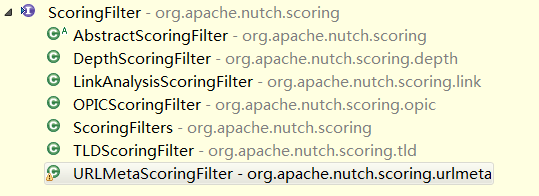

# Plugins
插件是Nutch实现定制化可配置裁剪的一个重要机制。
---
## 插件列表

* **Protocol**插件：对url进行抓取并返回内容。
* **ScoringFilter**插件：对网页进行评分。
* **URLFilter**插件：对url进行过滤。


## Protocol插件
`Protocol`插件是Nutch在`Fetch`阶段用来获取网页的插件，Nutch1.9实现了`ftp、file、http、httpclient`4种。后两个是网页抓取用的。httpclient用的是`Commons HttpClient 3.x`，已经不被支持了。我们先看Protocol插件的源码，最后会增加一个自己的Protocol来抓取网页，使用httpclient4。  
### 相关数据结构

#### Protocol接口

	/** A retriever of url content.  Implemented by protocol extensions. */
	public interface Protocol extends Pluggable, Configurable 
从注释我们可以看出，这个接口功能是获取URL的网页内容，所有Protocol插件扩展都需要实现这个接口。他的一个主要方法：

```
  /** Returns the Content for a fetchlist entry.
   */
  ProtocolOutput getProtocolOutput(Text url, CrawlDatum datum);
```

把抓取到的内容、状态信息等打包到ProtocolOutput里返回。

#### ProtocolOutPut类
ProtocolOutPut类里包含2个变量：


```
  private Content content;//抓取到的内容封装
  private ProtocolStatus status;//状态信息
```

每个变量包含的内容如下：


```
//Content类的成员变量，之前Fetcher阶段说的Content就是它
  private String url;

  private String base;//该URL由谁衍生来的（如果该URL是generate阶段产生的，则同url变量（看↑那个变量），Fetcher阶段并不仅仅抓取generate生成的URL，也会根据配置继续extract链接抓取，被extract处理的URL如果立马被抓取，则它的base和url变量就不同了）

  private byte[] content;

  private String contentType;

  private Metadata metadata;

  private MimeUtil mimeTypes;

//ProtocolStatus类成员变量，主要包含一个状态码、参数列表
  private int code;
  private long lastModified;
  private String[] args;
```

#### HttpBase
Nutch1.9用一个插件`lib-http`封装了http抓取的一些公共内容。包括HTTP异常类，`HttpRobotRulesParser`(Robots文件解析)，以及一个抽象类`HttpBase`来定义一些基础变量、公用 conf设置（如一些http插件和httpclient插件都一样的东西，一些请求头配置，代理）等。  
 Protocol的主要插件都继承自`HttpBase`，会省很多事。我们之后也决定继承它来获得一些便利。

	public abstract class HttpBase implements Protocol 

该抽象类实现了Protocol的`getProtocolOutput`方法，但是并不打算让它的子类覆盖它，因此它为子类留了一个抽象方法：

```
  protected abstract Response getResponse(URL url,
                                          CrawlDatum datum,
                                          boolean followRedirects)
    throws ProtocolException, IOException;
```
子类只需要覆盖这个方法，返回要求的`Response`让`HttpBase`在`getProtocolOutput`方法里处理即可，`HttpBase`在该方法里，会对`Response`的状态码进行判断，封装`ProtocolOutPut`，交给上层的`Fetcher`处理。  
而`Response`是一个接口，定义如下：

```
 /** Returns the URL used to retrieve this response. */
  public URL getUrl();

  /** Returns the response code. */
  public int getCode();

  /** Returns the value of a named header. */
  public String getHeader(String name);

  /** Returns all the headers. */
  public Metadata getHeaders();
  
  /** Returns the full content of the response. */
  public byte[] getContent();
```

可以看出是抓取结果的一个包装。  
下面情况就明朗了，我们的插件**应该**：  

1. 定义一个`Http`类继承`HttpBase`，因为它有`Protocol`接口(Protocol插件必需)。
2. `Http`类需要实现`getResponse`方法，该方法抓取url，并返回一个 实现了`Response`接口的对象。
3. 定义一个实现`Response`接口的类`HttpResponse`。

编写插件的时候应该注意，`getProtocolOutput`方法会被每个抓取线程所调用，因此该方法调用的所有方法都要注意**线程安全**问题，尽量避免对线程共享变量进行写操作之类的场景（一个插件可能使用一个HttpClient来进行抓取，这时候由HttpClient来保证线程安全）。

## ScoringFilter插件
`Scoring`是Nutch对网页进行评分的机制，网页的评分在搜索索引建立和`generate`等阶段均有使用。Nutch通过`ScoringFilter`插件对网页进行评分，并将分数反映在`CrawlDatum`里的score变量上。在Nutch的生命周期多个阶段，该插件都有调用。  
评分插件依然采用链式的插件调用机制，各评分插件需要实现`ScoringFilter`接口。`ScoringFilters`用来创建和缓存这些评分插件，并提供循环调用评分插件的方法。  
### Nutch中ScoringFilter插件出现和起作用的地方
#### Injector
在`injector`阶段，我们可以在种子文件中配置种子url的初始scores，如果未配置则默认是`1.0f`。
#### Generator
`ScoringFilters`插件在`Generator.Selector`类中使用，对每一个url执行Score插件的`generatorSortValue `产生一个排序值，然后从高到低选择前N个url进行抓取。

Nutch中其他使用到`ScoringFilters`插件的地方：

* ./src/java/org/apache/nutch/crawl/CrawlDbReducer.java
* ./src/java/org/apache/nutch/indexer/IndexerMapReduce.java
* ./src/java/org/apache/nutch/parse/ParseOutputFormat.java
* ./src/java/org/apache/nutch/parse/ParserChecker.java
* ./src/java/org/apache/nutch/parse/ParseSegment.java
* ./src/java/org/apache/nutch/tools/arc/ArcSegmentCreator.java
* ./src/java/org/apache/nutch/tools/FreeGenerator.java


#### ScoringFilter接口
 	A scoring filter will manipulate scoring variables in CrawlDatum and 
	in resulting search indexes. Filters can be chained in a specific order, 
	to provide multi-stage scoring adjustments.

从接口的注释中我们可以看到，评分插件主要影响到`CrawlDatum`中的`scoring`变量，并且在`solr`进行索引时会有用。评分插件可以链式调用。  
接口的方法如下，不同的方法会在Nutch流程不同的地方被调用（至少在下面的过程中被调用，对应方法序号：1inject，2fetch，3generate，4fetch后parse前，5parse后，6parse后，7updatedb，8index）。

>
> 1. 给Injector注入的种子URL设置初始分数（非0，一般是1）,`Injector`阶段调用。  
`public void injectedScore(Text url, CrawlDatum datum) throws ScoringFilterException;`
> 2. 设置一个从已抓取网页中析出的URL的初始分数（可以为0，因为该URL会继承它的入链的部分分数。  
  `public void initialScore(Text url, CrawlDatum datum) throws ScoringFilterException;`
> 3. 给URL产生一个排序值，以对URL进行排序，取**TopN**进行抓取在`generate`阶段调用。  
  `public float generatorSortValue(Text url, CrawlDatum datum, float initSort) throws ScoringFilterException;`
> 4. 把CrawlDatum里有关`scoring`的所有`MetaData`传递给改CrawlDatum的Content，供其对抽取的OUTLINKS评分使用，在解析OUTLINKS之前调用（Fetch阶段）。  
 `public void passScoreBeforeParsing(Text url, CrawlDatum datum, Content content) throws ScoringFilterException;`
> 5. 把该`CrawlDatum`解析阶段产生的`score`信息传递到解析之后的`parse`变量的`MetaData`里去。  
  `public void passScoreAfterParsing(Text url, Content content, Parse parse) throws ScoringFilterException;`
> 6. 把`score`信息从当前`CrawlDatum`传递到它的析出链接OUTLINKS中。  
   **@param parseData** 该URL的`ParseData`实例，插件可以修改其内部评分并持久化。  
   **@param targets** 插件可以修改其内部评分并持久化。  
   **@param adjust** 一个`CrawlDatum`实例，初始化为null，插件可以调整原始`CrawlDatum`的评分，并返回一个包含调整后的`CrawlDatum`（该方法的return参数，因此这个参数似乎没必要）。  
   **@param allCount** 所有OUTLINK的数量。  
   **@return** if needed, implementations may return an instance of CrawlDatum, with status `CrawlDatum.STATUS_LINKED`, which contains adjustments to be applied to the original CrawlDatum score(s) and metadata. This can be null if not needed.  
   `public CrawlDatum distributeScoreToOutlinks(Text fromUrl, ParseData parseData,
          Collection<Entry<Text, CrawlDatum>> targets, CrawlDatum adjust,
          int allCount) throws ScoringFilterException;`
> 7. 在`CrawlDb update`阶段，计算一个`CrawlDatum`的新`score`，计算依据是`old original datum`和`inlinked`，最后放入`the new datum`里，这个datum最后会存入`crawldb`。如果`old original datum`不存在，则用datum里的值和`inlinked`来计算（具体的计算逻辑可以不同，大体就是old和inlink计算出来了新的score，放入datum）。  
   **@param `old original datum`**, 当前`crawldb`里读取到的该URL的`CrawlDatum`，如果是新的URL，那么这个是null。  
   **@param datum `the new datum`**, 从generate阶段产生的`CrawlDatum`，这个datum经历了`generate->fetch->parse`这些阶段，最后它的状态不是db的状态（`datum.status > STATUS_DB_MAX`，是`fetch`的一个状态）存在于segments目录里一个segment下的`crawl_parse`目录。最后会用`old original datum`来更新它，最终将它存入`crawldb`。它的值可能不是有效的，因为有可能其他的segment在该datum所属segment进行`UpdateDB`之前先进行了该操作。  
   **@param inlinked** 当前批次发现的所有指向该`CrawlDatum`的`CrawlDatum-s`。  
  `public void updateDb core(Text url, CrawlDatum old, CrawlDatum datum, List<CrawlDatum> inlinked) throws ScoringFilterException;`
> 8. 计算`Lucene document boost`，它出现在`Solr indexing job`阶段，在处理完NutchDocument文档最后，给每个文档计算该值。  
   **@param `doc Lucene document`**. 插件可以在交给solr索引前改变它的内容，最后存的是它。  
   **@param `dbDatum`** `crawldb`里的该URL的`CrawlDatum`。  
   **@param `fetchDatum`** 同`updateDbScore`里那个`the new datum`。  
   **@param initScore** initial boost value for the Lucene document.  
   `public float indexerScore(Text url, NutchDocument doc, CrawlDatum dbDatum,
          CrawlDatum fetchDatum, Parse parse, Inlinks inlinks, float initScore) throws ScoringFilterException;`

### Nutch中已有的`ScoringFilter`
Nutch中已经实现了几个评分插件如下图：  


#### `DepthScoringFilter`
限制URL从初始种子开始计算的深度，如果一个URL的深度**大于等于**默认最大深度或者Nutch配置文件里设定的允许最大深数（`scoring.depth.max`），则该URL的所有**OUTLINKS**会被抛掉。使用该插件，会在`CrawlDatum`的`MetaData`里记录该`CrawlDatum`所属的深度`_depth_`和允许的最大深度`_maxdepth_`。  
该插件对`generate`阶段URL排序分数影响：
	插件处理后分数 = 处理前分数 * (1 + (允许最大深度 - 当前URL深度));//允许最大深度如未指定默认为1000
其他地方只是对深度的修改，不涉及分数处理。

#### `OPICScoringFilter`-在线网页重要度计算
This plugin implements a variant of an **Online Page Importance Computation (OPIC) score**//, described in this paper: [【Abiteboul, Serge and Preda, Mihai and Cobena, Gregory (2003), Adaptive On-Line Page Importance Computation】](http://www.www2003.org/cdrom/papers/refereed/p007/p7-abiteboul.html)   
OPIC算法的目的是在爬完所有URL的同时，计算出每个URL的分数（重要度）。  
如上所述`Nutch1.x`的`OPICScoringFilter`实现了上述论文的一个**变体**，下面是上述论文中的OPIC算法，和Nutch中的不同。
```
OPIC:
On-line Page Importance Computation
//C[i]表示页面i当前的Cash，H[i]表示在计算过程中页面i累计收到的cash的总数(history)。
//每个URL（页面）都有初始cash，爬取一个URL，该URL的cash被平均分给它的OUTLINKS，
//然后其cash清零。同时将其H增加cash的数值。最终URL的重要度是其H和最后留存的cash的和之后归一化（反正所有页面的重要度之和是1，咱就不归了）。
//我们可以看出，一个URL被抓的次数越多，其分出的cash越多，重要度越大（如果出现个环的话，环内自流通。。我说的是可以多次抓取的情况）；
//如果所有URL只抓一次，一般情况下一个URL的入链越多，其会被分配越多的cash，最后重要度也越大。


for each i let C[i] := 1/n ; //C数组保存了网络中每个URL的当前cash。总和是1
							//实际中，我们并不知道网络中有多少URL
							//我们的策略是给初始种子设定cash，网络中只流通这些cash
							//而非种子URL，cash默认是0
for each i let H[i] := 0 ;	//H数组保存了网络中每个URL的当前流过的cash（history）
let G:=0 ;	//当前所有URL的H总数，统计用
do forever
begin
  choose some node i ;//选择种子URL i，进行爬取
  %% each node is selected
  %% infinitely often

  H[i] += C[i];//爬取i完成后，URL i的H ，为其当前H加上其cash变量
				//可以看到只有爬取完后，URL才会有H。对未爬取的URL，H只会是0
				//OPIC算法的目的是在爬完所有URL的同时，计算出每个URL的重要度
				//而我们怎么利用它来指导爬取路径呢？我们按照URL持有的cash来排序，也就是
				//cash多的URL会被优先爬取，正所谓打土豪分田地。
  %% single disk access per page

  for each child j of i,
    do C[j] += C[i]/out[i];  //把i的cash，平均分配给其OUTLINKS
  %% Distribution of cash
  %% depends on L

  G += C[i];	//统计当前所有URL的H总和。
  C[i] := 0 ; 	//清零URL i所持有的cash。
  
end
//每一次循环，都可以计算页面的重要度Q[i]=(H[i]+C[i])/(G+1)。
```
Nutch使用了OPIC变种作为默认的URL评分策略，它只设置了一个score变量，score大的URL会被优先爬取。  
因此`Nutch1.x`的OPIC实现与Abiteboul在论文提出的OPIC并不完全相同，具体表现为：
  1. Nutch中并没有区分C[i]和H[i]，使用score一个变量记录页面累积的h和cash，在分配过程中也是将这个累积的分数全部平均分配给子页面，分配完毕后cash也**并不清零**（因为没有cash这个变量啊。。这个score既是cash又是h，没法清0）。
  2. Nutch中并没有virtual root page，也就是说叶子页面（即没有outlink的页面）的cash将会丢失（爬完这些页面后，按算法它的cash要被清零，原算法每个页面都指向这个虚拟页面，这个虚拟页面又指向所有页面。因此原算法效果类似于**叶子页面指向其他所有页面**。但它没有，因此它爬完后如果清除cash那么网络中总cash会变少！当然Nutch并没遵循算法，cash也不清零。。）。   
总之是**这个变种和原算法差别比较大**。如果实现了该论文中算法，则可以按照当前URL的cash多少来指导爬取（论文作者论述了随机、轮询、先抓cash大的网页（贪婪策略）三种爬取策略，得出贪婪策略网页重要度算法收敛最快，还有实验各种数据做证明，因此我们用该方法指导爬取），按照H+C大小评判网页重要度，在索引等的时候用的着。

在`Nutch2.3`版本中OPIC插件是按照原论文算法来的。

下面的文档提供了更多的信息：  
[【Fixing the OPIC algorithm in Nutch】](http://wiki.apache.org/nutch/FixingOpicScoring)    
<http://dustin.iteye.com/blog/349436>中文章最后提供了一个例子来描述Nutch中的类OPIC评分算法。

下面是`Nutch1.9 OPICScoringFilter` 实现，抓取顺序、网页重要度均受这个`score`影响。

* `initialScore`   
初始化score为`0.0`。因为析出的每个URL都有至少一个入链，会继承分数。
* `generatorSortValue`   
`排序分数 = CrawlDatum内分数 * 排序初始分数`
* `updateDbScore(Text url, CrawlDatum old, CrawlDatum datum, List<CrawlDatum> inlinked)`   
更新datum的分数为，old的分数+（所有入链的分数总和）
* `passScoreBeforeParsing(Text url, CrawlDatum datum, Content content)`  
把datum的分数存入content的Meta信息里: `content.getMetadata().set(Nutch.SCORE_KEY, "" + datum.getScore())`
* `passScoreAfterParsing(Text url, Content content, Parse parse)`  
把content里的分数存入parse里: ` parse.getData().getContentMeta().set(Nutch.SCORE_KEY, content.getMetadata().get(Nutch.SCORE_KEY))`
* **传递分数给出链`distributeScoreToOutlinks(Text fromUrl, ParseData parseData, Collection<Entry<Text, CrawlDatum>> targets, CrawlDatum adjust, int allCount)`**  
	1. 取得parseData里存储的score。
	2. score = score/出链个数
	3. 得出内链（出链host与fromUrl相同）分数和外链（出链host与fromUrl不同）分数，计算公式：
	`内链分数 = score * 内链分数因子（默认1，可配置）;
    外链分数 = score * 外链分数因子（默认1，可配置）;`
	4. 根据内、外链不同分别将targets里的出链`CrawlDatum`设置分数。
	5. adjust原样返回（未调整）。
